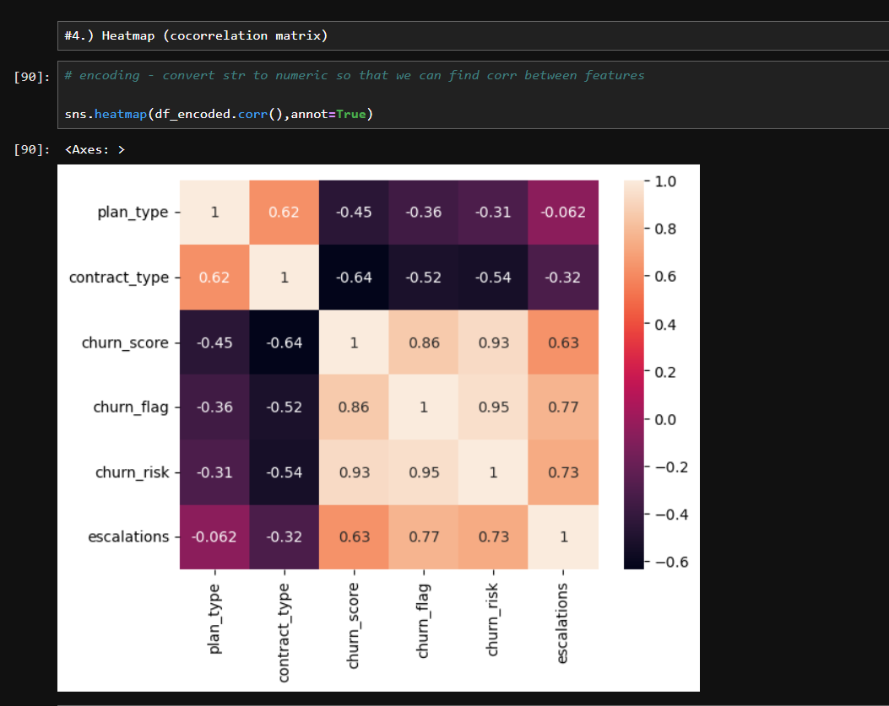
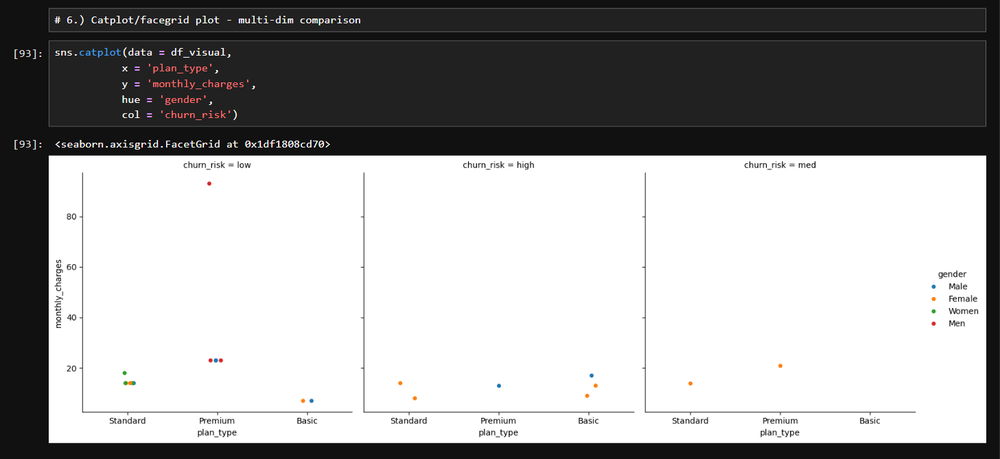

# Customer Churn Analysis

An end-to-end data analytics project using **SQL, Python, Pandas, NumPy, Matplotlib, and Seaborn** to analyze customer churn, retention, revenue risk, and customer behavior.

## 📊 Key Results

- **Churn Rate:** 28.57%
- **Retention Rate:** 71.43%
- **ARPU:** ₹18.85K
- **Revenue at Risk:** ₹73.94K
- **Escalation–Churn Correlation:** 0.77

## 🔍 Key Insights

- Basic plan has the highest churn rate — **60%**
- Referral customers show **83.33% churn**
- Support escalations show a strong relationship with churn
- Karnataka, Meghalaya, and Telangana have the highest observed churn rates

## 📈 Visualizations

### Churn Correlation Heatmap



### Customer Churn Pairplot



## 🛠️ Tools Used

**Python • SQL/SQLite • Pandas • NumPy • Matplotlib • Seaborn • Jupyter Notebook**

## 📂 Project Structure

```text
Churn-Analysis/
├── data/
├── notebook/
├── visualizations/
├── report/
├── README.md
└── requirements.txt
